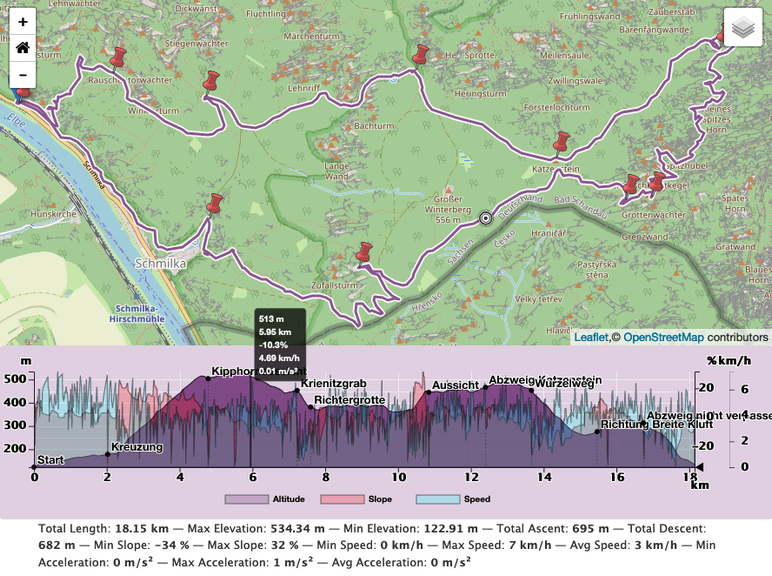

<a href="https://wordpress.org/plugins/extensions-leaflet-map/">Official WordPress Plugin</a>

# Extensions for Leaflet Map

Contributors: hupe13  
Tags: leaflet-map, elevation, markercluster, zoomhome, hover, fullscreen  
Requires at least: 5.5.3  
Tested up to: 5.7  
Stable tag: 1.4  
License: GPLv2 or later  
License URI: https://www.gnu.org/licenses/gpl-2.0.html  

## Description

Plugin to extend the WordPress Plugin <a href="https://wordpress.org/plugins/leaflet-map/">Leaflet Map</a>.

### WordPress Plugin

You need to install the plugin "Leaflet Map".

### Involved Leaflet Plugins

*   [leaflet-elevation](https://github.com/Raruto/leaflet-elevation)
*   [Leaflet.markercluster](https://github.com/Leaflet/Leaflet.markercluster)
*   [Leaflet.FeatureGroup.SubGroup](https://github.com/ghybs/Leaflet.FeatureGroup.SubGroup)
*   [leaflet.zoomhome](https://github.com/torfsen/leaflet.zoomhome)
*   [leaflet.fullscreen](https://github.com/brunob/leaflet.fullscreen)
*   [Leaflet.GestureHandling](https://github.com/elmarquis/Leaflet.GestureHandling)

### Other functions

*   hovergeojson: Use it to highlight a geojson area or line on mouse over.
*   Hide Markers: Use it when a track in a GPX file contains some markers and you don't want to display them on the map.
*   Switch tile layers with L.control.layers.

## Screenshots

1. Track with elevation profile and Switching Tile Layers  
2. Hover a Geojson area  
3. Markercluster and Groups  
4. GestureHandling  

## Frequently Asked Questions

### Display a track with elevation profile

You may go to Settings -> Leaflet Map -> Leaflet Map Extensions and select a color theme.

<pre><code>[leaflet-map ....]
// at least one marker if you use it with zoomehomemap
[leaflet-marker lat=... lng=... ...]Start[/leaflet-marker]
[elevation gpx="url_gpx_file"]
// or
[elevation gpx="url_gpx_file" summary=1]
</code></pre>

### Switching Tile Layers

First go to Settings -> Leaflet Map -> Leaflet Map Extensions and configure tile layers.

<pre><code>[leaflet-map mapid="..." ...]
[layerswitch]
</code></pre>

### Leaflet.markercluster

Many markers on a map become confusing. That is why they are clustered.

You can define some parameters in Settings -> Leaflet Map -> Leaflet Map Extensions or per map.
<pre><code>[leaflet-map ....]
// many markers
[leaflet-marker lat=... lng=... ...]poi1[/leaflet-marker]
[leaflet-marker lat=... lng=... ...]poi2[/leaflet-marker]
 ...
[leaflet-marker lat=... lng=... ...]poixx[/leaflet-marker]
[cluster]
// or
[cluster radius="..." zoom="..." spiderfy=0]
[zoomhomemap]
</code></pre>

### Leaflet.FeatureGroup.SubGroup

dynamically add/remove groups of markers from Marker Cluster.   
Parameter:

<ul>
<li>feat - possible values: iconUrl, title</li>
<li>strings - comma separated strings to distinguish the markers, e.g. an unique string in iconUrl or title</li>
<li>groups - comma separated labels appear in the selection menu</li>
<li>The number of strings and groups must match.</li>
</ul>
<pre><code>[leaflet-marker iconUrl="...red..." ... ] ... [/leaflet-marker]
[leaflet-marker iconUrl="...green..." ... ] ... [/leaflet-marker]
//many markers
[markerClusterGroup feat="iconUrl" strings="red,green" groups="rot,gruen"]
</code></pre>
or
<pre><code>[leaflet-marker title="first ..."  ... ] ... [/leaflet-marker]
[leaflet-marker title="second ..." ... ] ... [/leaflet-marker]
//many markers
[markerClusterGroup feat="title" strings="first,second" groups="First Group,Second Group"]
</code></pre>

### leaflet.zoomhome

&quot;Home&quot; button to reset the view. A must have for clustering markers.

There are several usage possibilities, see the help in Settings -> Leaflet Map -> Leaflet Map Extensions.

<pre>
<code>[leaflet-map lat=... lng=... zoom=... !fitbounds]
[leaflet-marker ....]
[zoomhomemap !fit]</code>
</pre>or
<pre><code>[leaflet-map ....]
  ...
[zoomhomemap]
</code></pre>

### Fullscreen

<pre><code>[fullscreen]</code></pre>

### hovergeojson

Use it to highlight a geojson area or line on mouse over.

<pre><code>[leaflet-map ...]
[leaflet-geojson src="//url/to/file.geojson" color="..."]...[/leaflet-geojson]
//or / and
[leaflet-gpx src="//url/to/file.gpx" color="..."]...[/leaflet-gpx]
//or / and
[leaflet-kml src="//url/to/file.kml" color="..."]...[/leaflet-kml]
[hover]
</code></pre>

### GestureHandling

Brings the basic functionality of Gesture Handling into Leaflet Map.
Prevents users from getting trapped on the map when scrolling a long page.
You can enable it for all maps or for particular maps. It becomes active
only when dragging or scrollWheelZoom is enabled.
You can define the options in Settings -> Leaflet Map -> Leaflet Map Extensions.

### Hide Markers

If a GPX track contains waypoints that you do not want to display.

<pre><code>[leaflet-map ...]
[leaflet-gpx src="//url/to/file.gpx" ... ]
[hidemarkers]
</code></pre>

### More

Maybe new functions are <a href="https://github.com/hupe13/extensions-leaflet-map-testing">here</a>.

## Installation

You can install the plugin through the WordPress installer under Plugins → Add New by searching for "extensions-leaflet-map".

Alternatively you can download the file from here, unzip it and move the unzipped contents to the wp-content/plugins folder of your WordPress installation. You will then be able to activate the plugin.

Go to Settings - Leaflet Map - Extensions for Leaflet Map and get some documentation and settings options.

## Changelog

### 1.5 (Plan)

* leaflet-elevation 1.6.8
* https://github.com/Raruto/leaflet-gesture-handling (is newer)
* fixed gesture to load only with leaflet-map
* deal with safari bug

### 1.4

* zoomhomemap works on multiple maps on a page now.
* fixing markercluster and markerClusterGroup for this.

### 1.3

* Shortcodes can be used on more than one map per page, except zoomhomemap.  
* Parameter for GestureHandling  
* fixed markerClusterGroup  
* prepare for translation
* documentation

### 1.2

* documentation on a help page
* prepare for translation
* new setting options for <code>[markercluster]</code>
* new setting options for <code>[zoomhomemap]</code>

### 1.1
New functions:
* markerClusterGroup
* Switching Tile Layers

### 1.0.1
* leaflet-elevation v1.6.7

### 1.0
* First Release

## Upgrade Notice

### 1.4
Please check the pages where you use zoomhomemap, if it still works as it should.
Check the help at /wp-admin/admin.php?page=extensions-leaflet-map&tab=zoomhome

### 1.0.1
Elevation profile on smartphone works now.
