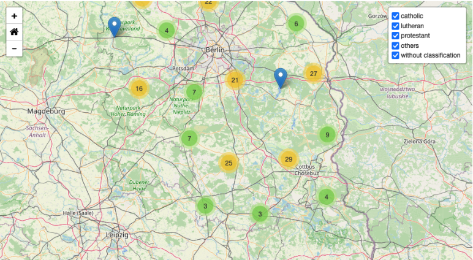

<a href="https://wordpress.org/plugins/extensions-leaflet-map/">Official Wordpress Plugin</a>

# Extensions for Leaflet Map

Stable tag: 1.1
Requires at least: 5.5.3
Tested up to: 5.7
License: GPLv2 or later
License URI: https://www.gnu.org/licenses/gpl-2.0.html
Tags: leaflet-map, elevation, markercluster, zoomhome, hover, fullscreen
Contributors: hupe13

## Description

Plugin to extend the Wordpress Plugin <a href="https://wordpress.org/plugins/leaflet-map/">Leaflet Map</a>, see Bozdoz <a href="https://github.com/bozdoz/wp-plugin-leaflet-map#how-can-i-add-another-leaflet-plugin">FAQ</a>.

### Wordpress Plugin

You need to install the plugin "Leaflet Map".

### Involved Leaflet Plugins

*   [leaflet-elevation](https://github.com/Raruto/leaflet-elevation)
*   [leaflet.fullscreen](https://github.com/brunob/leaflet.fullscreen)
*   [Leaflet.GestureHandling](https://github.com/elmarquis/Leaflet.GestureHandling)
*   [Leaflet.markercluster](https://github.com/Leaflet/Leaflet.markercluster)
*   [leaflet.zoomhome](https://github.com/torfsen/leaflet.zoomhome)
*   [Leaflet.FeatureGroup.SubGroup](https://github.com/ghybs/Leaflet.FeatureGroup.SubGroup)

### Other functions

*   hovergeojson: Use it to highlight a geojson area or line on mouse over.
*   Hide Markers: Use it when a track in a GPX file contains some markers and you don't want to display them on the map.
*   Switch tile layers with L.control.layers.

### Shortcodes

#### Display a track with elevation profile

<pre>
[leaflet-map ....]
// at least one marker if you use it with zoomehomemap
[leaflet-marker lat=... lng=... ...]Start[/leaflet-marker]
[elevation gpx="url_gpx_file"]
// or
[elevation gpx="url_gpx_file" summary=1]
</pre>

#### Leaflet.markercluster

Many markers on a map become confusing. That is why they are clustered.

<pre>
[leaflet-map ....]
// many markers
[leaflet-marker lat=... lng=... ...]poi1[/leaflet-marker]
[leaflet-marker lat=... lng=... ...]poi2[/leaflet-marker]
 ...
[leaflet-marker lat=... lng=... ...]poixx[/leaflet-marker]
[cluster]
</pre>

#### Leaflet.FeatureGroup.SubGroup

dynamically add/remove groups of markers from Marker Cluster.
Parameter:
* feat - possible meaningful values: iconUrl, title, (other???)
* strings - comma separated strings to distinguish the markers, e.g. an unique string in iconUrl or title
* groups - comma separated labels appear in the selection menu
* The number of strings and groups must match.

<pre>
[leaflet-marker title="..." iconUrl="...red..." ... ] ... [/leaflet-marker]
[leaflet-marker title="..." iconUrl="...green..." ... ] ... [/leaflet-marker]
//many markers
[markerClusterGroup feat="iconUrl" strings="red,green" groups="rot,gruen"]';
</pre>
Here the groups are differentiated according to the color of the markers.

#### leaflet.zoomhome

"Home" button to reset the view.

<pre>
[leaflet-map ....]
  ...
[zoomhomemap]
</pre>

#### Fullscreen

<pre>
[fullscreen]
</pre>

#### GestureHandling

<pre>
[leaflet-map dragging ... ]
// or
[leaflet-map scrollwheel ... ]
// or
[leaflet-map dragging scrollwheel ... ]
</pre>

#### Hide Markers

<pre>
[leaflet-map ...]
[leaflet-gpx src="//url/to/file.gpx" ... ]
[hidemarkers]
</pre>

#### hovergeojson

Use it to highlight a geojson area or line on mouse over.

<pre>
[leaflet-map ...]
[leaflet-geojson src="//url/to/file.geojson" color="..."]...[/leaflet-geojson]
//or / and
[leaflet-gpx src="//url/to/file.gpx" color="..."]...[/leaflet-gpx]
//or / and
[leaflet-kml src="//url/to/file.kml" color="..."]...[/leaflet-kml]
[hover]
</pre>

#### Switching Tile Layers

First go to Settings -> Leaflet Map -> Leaflet Map Extensions and configure tile layers.

<pre>
[leaflet-map mapid="..." ...]
[layerswitch]
</pre>

## Screenshots

1. Track with elevation profile and Switching Tile Layers 
2. Hover a Geojson area 
3. Markercluster and Groups 
4. GestureHandling 

#### More

<a href="https://phw-web.de/doku/leaflet/">Dokumentation</a> auf deutsch.

Maybe new functions are <a href="https://github.com/hupe13/extensions-leaflet-map-testing">here</a>.

## Installation

You can install the plugin through the WordPress installer under Plugins → Add New by searching for "extensions-leaflet-map".

Alternatively you can download the file from here, unzip it and move the unzipped contents to the wp-content/plugins folder of your WordPress installation. You will then be able to activate the plugin.

(Optionally) Go to Settings - Leaflet Map - Extensions for Leaflet Map and
* select a theme for elevation.
* configure tile layer(s) if you want to switch tile layers.

## Changelog

### 1.1
New functions:
* markerClusterGroup
* Switching Tile Layers

### 1.0.1
* leaflet-elevation v1.6.7

### 1.0
* First Release

## Upgrade Notice

### 1.0.1
Elevation profile on smartphone works now.
